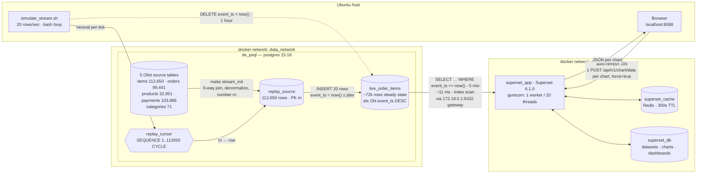
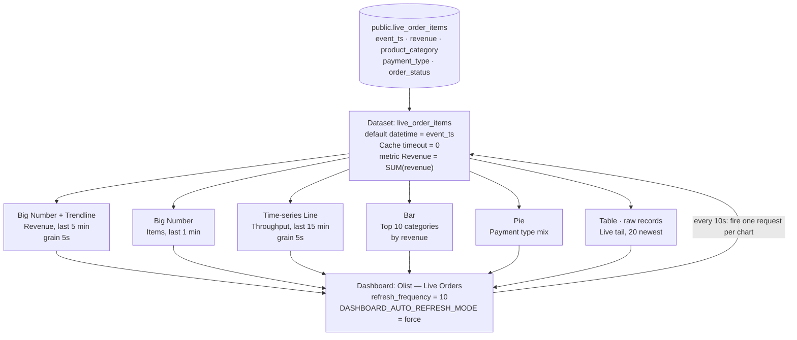
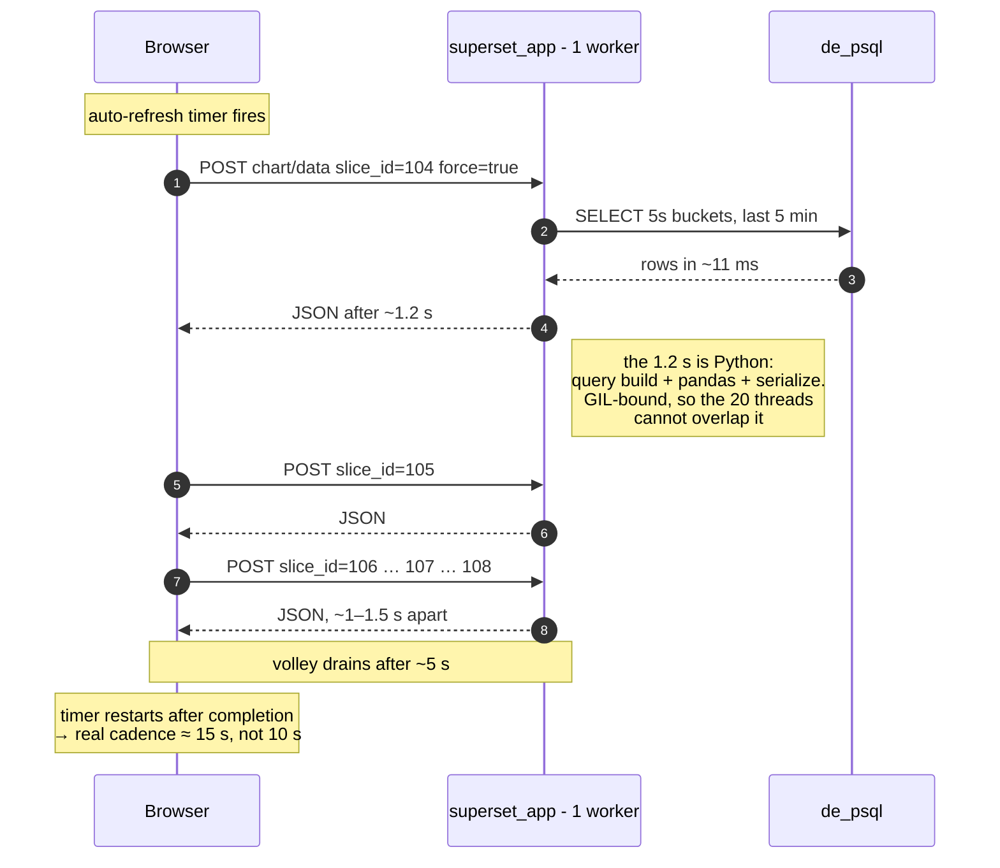

# Near real-time dashboard with Apache Superset on `de_psql`

An operational "orders are flowing in right now" dashboard that auto-refreshes every 10 seconds,
built from the Olist data already loaded into the `de_psql` Postgres container.

Verified against Superset **6.1.0** (`superset_app`, http://localhost:8088) and PostgreSQL **15.18**.

---

## Quick start

Assumes the Olist CSVs are already loaded into `de_psql` — see the `\copy` commands at the bottom of
[psql_schemas.sql](../psql_schemas.sql). Run these from the repo root:

```bash
make stream_init    # create replay_source + live_order_items
make stream         # 20 rows/sec, Ctrl-C to stop
make stream_stats   # confirm rows are landing
```

## 1. Reference examples

The mechanism this demo relies on, and prior art worth reading:

| Reference | Why it matters here |
|---|---|
| [apache/superset PR #21924](https://github.com/apache/superset/pull/21924) | Moved the auto-refresh interval list out of hard-coded frontend constants into `DASHBOARD_AUTO_REFRESH_INTERVALS`. This is why 10s works out of the box and 5s needs a config override. |
| [apache/superset Discussion #36873](https://github.com/apache/superset/discussions/36873) | How to change the default auto-refresh interval. |
| [apache/superset Issue #16944](https://github.com/apache/superset/issues/16944) | Force-refresh vs normal refresh during auto-refresh. Explains why `DASHBOARD_AUTO_REFRESH_MODE = "force"` (the default) is what stops a 10s dashboard from serving 300s-old cached results — and why it costs a real query every tick. |
| [theodorecurtil/real_time_dashboarding](https://github.com/theodorecurtil/real_time_dashboarding) | End-to-end streaming-to-Superset demo repo. Same shape as this one, with Kafka where we use a psql insert loop. |
| [Preset — Guide to Lightning-Fast Superset Dashboards](https://preset.io/blog/the-data-engineers-guide-to-lightning-fast-apache-superset-dashboards/) | Caching layers (database / schema / dataset / chart) and where to set TTLs. |
| [Snowflake — Real-Time Operational Dashboards with Apache Superset](https://medium.com/snowflake/building-real-time-operational-dashboards-with-apache-superset-and-snowflake-23f625e07d7c) | The chart-composition pattern (big-number KPIs + throughput line + live tail) copied below. |

## 2. Architecture

Two independent Docker Compose projects on separate networks. The whole demo is one write path
(generator → `live_order_items`) and one read path (Superset → the same table), which is what makes
it feel live without any streaming infrastructure.



Superset reaches Postgres through the **`172.19.0.1` bridge gateway**, not a hostname — the two
projects are on different networks, so there is no DNS between them. That is the one fragile edge in
this diagram; see §6.

### The read path in detail

One dataset feeds all six charts; the dashboard only schedules the refresh.



### What one refresh cycle actually looks like

Measured from real `superset_app` access logs on dashboard `id=10`, which had five charts built
(`slice_id` `104`–`108`). Charts do **not** repaint together — the dashboard interval schedules the
volley, it does not make it atomic.



Consequences worth knowing before you demo this:

- **Charts land one at a time**, ~1–1.5s apart. Normal. Raise `SERVER_WORKER_AMOUNT` (default `1`,
  set in `superset/docker/.env-local`) to get real parallelism.
- **`force=true` on every request** means no chart can return from Redis. That is deliberate — it is
  what keeps the numbers fresh — but it costs a full round trip per chart per tick.
- **The effective interval is `10s + volley duration`**, because the timer restarts on completion.

## 3. Why there is a simulator

The loaded data is completely static, so a refreshing dashboard on the raw tables renders frozen:

- `olist_order_items_dataset.created_at` — `count(DISTINCT created_at) = 1`. Every one of the 112,650
  rows carries the timestamp of the single bulk-load transaction.
- `olist_orders_dataset.order_purchase_timestamp` runs `2016-09-04` → `2018-10-17`, and is
  `varchar(32)` rather than a timestamp type.
- The only indexes on any table are primary keys.

[superset_streaming.sql](superset_streaming.sql) therefore builds two objects:

- **`replay_source`** — a denormalized, pre-joined snapshot of all five populated tables, numbered
  `rn = 1..112650`. Pre-joining means the 10-second dashboard never joins at query time.
- **`live_order_items`** — the append-only target the dashboard reads. `event_ts` is real wall-clock
  time, and `revenue` is a stored generated column (`price + freight_value`).

[simulate_stream.sh](simulate_stream.sh) walks `replay_source` via the `replay_cursor` sequence and
appends a batch per second.

### Tables used, and why

| Source table | Rows | Contribution |
|---|---:|---|
| `olist_order_items_dataset` | 112,650 | The grain — one event per order item. `price`, `freight_value` |
| `olist_orders_dataset` | 99,441 | `order_status`, `customer_id` |
| `olist_products_dataset` | 32,951 | Bridges item → category |
| `product_category_name_translation` | 71 | English category label |
| `olist_order_payments_dataset` | 103,886 | `payment_type`, restricted to `payment_sequential = 1` |

Two data quirks handled in the SQL:

- Payments are joined **filtered to `payment_sequential = 1`**. Joining all payment rows on `order_id`
  fans out the item grain and inflates revenue. Confirmation that it worked:
  `SELECT count(*) FROM replay_source` returns exactly **112,650**, matching the item count.
- `product_category` is `COALESCE(english, portuguese, 'unknown')`. 610 products have no category at
  all, and the first row of `product_category_name_translation.csv` carries a UTF-8 BOM in its key so
  it never matches the join — those fall back to the Portuguese name instead of going NULL.

## 4. Start the stream

```bash
# once — creates replay_source, live_order_items, replay_cursor
make stream_init

# in a second terminal — 20 rows/sec, Ctrl-C to stop
make stream

# sanity check before touching Superset
make stream_stats
```

`make stream` prints one line per tick (`inserted | pruned | at`). Expected `stream_stats` output
after ~10 seconds:

```
 rows | distinct_ts |           oldest           |          newest           | last_minute | revenue
------+-------------+----------------------------+---------------------------+-------------+----------
  220 |         220 | 2026-07-29 08:19:35.329259 | 2026-07-29 08:19:47.26175 |         220 | 34804.28
```

`rows == distinct_ts` is the check that matters. `now()` is transaction time, so without the
sub-second jitter the script applies, all 20 rows of a tick would share one timestamp and the
5-second-grain charts would render as a step function.

Rate and retention are adjustable:

```bash
./simulate_stream.sh 200 1              # 200 rows/sec
RETENTION='10 minutes' ./simulate_stream.sh   # tighter window (default: 1 hour)
```

`make stream_reset` truncates the table and restarts the cursor so the demo can be re-run.

If you want an exact cadence without a `docker exec` per tick, psql's `\watch` drives the same
statement from one long-lived session (verified working on 15.18 — it needs a statement that returns
rows, which the tick's trailing `SELECT` does):

```bash
{ cat stream_tick.sql; echo '\watch 1'; } | \
  docker exec -i de_psql psql -U admin -d postgres -v batch=20 -v retention='1 hour' -f -
```

The bash loop remains the supported path; it handles Ctrl-C cleanly and takes the rate as an argument.

At the default 20 rows/s the table settles at ~72k rows. A 5-second-bucket revenue query over the
last 5 minutes at that size uses `idx_live_order_items_event_ts` and runs in **~11 ms**, so six
charts every 10 seconds is well within budget.

## 5. Build the dashboard

The Postgres connection already exists in Superset as **`PostgreSQL`**
(`admin@172.19.0.1:5432/postgres`), so this starts at the dataset step.

### 5.1 Add the dataset

1. **Datasets → + Dataset** (top right).
2. Database **PostgreSQL**, schema **public**, table **live_order_items**.
3. **Create dataset and create chart** → then back out to Datasets; the charts are built one at a
   time below.

### 5.2 Configure the dataset — do not skip this

Hover the dataset row → **Edit** (pencil).

- **Settings** tab → **Cache timeout** = `0`.
  `DATA_CACHE_CONFIG` in this deployment is Redis with a 300-second default. Dashboard auto-refresh
  bypasses it (`DASHBOARD_AUTO_REFRESH_MODE = "force"`), but chart *editing* does not — without this
  you will spend the next hour looking at five-minute-old numbers in Explore and think the stream
  is broken.
- **Columns** tab → expand `event_ts` → confirm **Is temporal** is checked and set it as the
  **Default datetime** column.
- **Metrics** tab → **+ Add item**: metric name `total_revenue`, SQL expression `SUM(revenue)`,
  label `Revenue`.

Save.

### 5.3 The six charts

**Charts → + Chart** for each; dataset is `live_order_items` every time.

Setting the time window is the step most likely to trip you up. Since Superset 3.0 the time range is
an ad-hoc filter, not a separate control: in the **Filters** box, click the pre-populated
`event_ts (No filter)` chip, then in the popover choose **Custom** and set
**START** = *Relative Date/Time* → `5` `minutes` *Before*, **END** = *Now*.
(The **Advanced** tab accepts `now-5 minutes` and `now` typed directly, if you prefer.)

| # | Chart name | Viz type | Configuration |
|---|---|---|---|
| 1 | Revenue, last 5 min | **Big Number with Trendline** | X-axis `event_ts`, Time Grain **5 second**, Metric `Revenue`, filter last 5 minutes |
| 2 | Items, last 1 min | **Big Number** | Metric `COUNT(*)`, filter last 1 minute |
| 3 | Throughput | **Time-series Line Chart** | X-axis `event_ts`, Time Grain **5 second**, Metric `COUNT(*)`, filter last 15 minutes |
| 4 | Top categories by revenue | **Bar Chart** | Dimension `product_category`, Metric `Revenue`, Row limit `10`, Sort descending, filter last 5 minutes |
| 5 | Payment type mix | **Pie Chart** | Dimension `payment_type`, Metric `COUNT(*)`, filter last 5 minutes |
| 6 | Live tail | **Table** | Query mode **Raw records**; Columns `event_ts, order_id, product_category, price, order_status`; Ordering `event_ts [desc]`; Row limit `20`; **no time filter** — desc + limit always shows the newest rows |

`5 second` and `30 second` are genuine grain options for Postgres — Superset's Postgres engine spec
implements `FIVE_SECONDS` and `THIRTY_SECONDS`, so no calculated column is needed.

To sanity-check any chart against raw SQL, this is what chart 1 compiles to:

```sql
SELECT DATE_TRUNC('minute', event_ts)
         + INTERVAL '5 seconds' * FLOOR(EXTRACT(SECOND FROM event_ts) / 5) AS bucket,
       SUM(revenue) AS "Revenue"
FROM public.live_order_items
WHERE event_ts >= now() - interval '5 minutes'
GROUP BY 1 ORDER BY 1;
```

### 5.4 Assemble and set auto-refresh

1. **Dashboards → + Dashboard**, name it e.g. *Olist — Live Orders*.
2. Drag the six charts from the right-hand panel. Suggested layout: charts 1–2 as a KPI row across
   the top, chart 3 full width beneath, charts 4–5 side by side, chart 6 along the bottom.
3. While still in **Edit** mode: **⋯ → Set auto-refresh interval → 10 seconds**.
4. **Save.**

Step 3 must happen in edit mode followed by a save. Setting the interval from view mode applies to
the current browser session only and is lost on reload — persisting it writes
`refresh_frequency` into `dashboards.json_metadata`.

With `make stream` running, the KPI numbers should climb and the live tail's top row should change
every 10 seconds with no interaction.

## 6. Troubleshooting

**Charts empty, but `make stream_stats` shows rows.**
Widen the filter to *Last day* to confirm data is visible at all. If it appears there, it is a
timezone issue: `de_psql` runs `Etc/UTC` and `event_ts` is UTC, and Superset evaluates relative
ranges in UTC, so these normally agree — but a browser/database offset shows up exactly this way.

**Numbers frozen while the loop is running.**
Cache. Confirm **Cache timeout = 0** on the dataset (§5.2), and that the refresh interval was saved
from edit mode rather than set in view mode.

**Superset can't connect after `make down && make up`.**
The connection is pinned to `172.19.0.1`, the `data_network` bridge gateway. Recreating the network
can change that address. Either re-point the connection URI, or attach the Superset containers to
`data_network` and use the hostname `de_psql:5432` instead — the two compose projects are on separate
networks today (`superset_default` vs `data_network`), which is why the gateway IP is being used at
all.

**`make stream` drifts slightly** — each tick spawns a `docker exec`, so the real cadence is ~1.05s
and a wall-clock second is occasionally skipped. It is cosmetic at these rates.

## 7. Appendix — getting a true 5-second refresh

10 seconds is the shortest interval in the shipped `DASHBOARD_AUTO_REFRESH_INTERVALS`
(`/app/superset/config.py:1339` in the 6.1.0 image). A genuine 5-second option requires a config
override in the Superset checkout, **which is a separate project outside this repo** at
`/home/hongong/Documents/ongxuanhong/superset`.

Create `docker/pythonpath_dev/superset_config_docker.py` there (git-ignored upstream, and imported
last by `superset_config.py`, so it overrides everything):

```python
DASHBOARD_AUTO_REFRESH_INTERVALS = [
    [0, "Don't refresh"],
    [5, "5 seconds"],
    [10, "10 seconds"],
    [30, "30 seconds"],
    [60, "1 minute"],
    [300, "5 minutes"],
    [1800, "30 minutes"],
    [3600, "1 hour"],
    [21600, "6 hours"],
    [43200, "12 hours"],
    [86400, "24 hours"],
]
```

`./docker` is bind-mounted into the containers, so a restart is enough — no rebuild:

```bash
cd /home/hongong/Documents/ongxuanhong/superset
docker compose -f docker-compose-image-tag.yml restart superset superset-worker superset-worker-beat
```

Use `docker-compose-image-tag.yml` specifically — that is the file the running stack was started
from, not `docker-compose.yml`. All three services need the restart because they share the same
config mount, and the workers execute queries in async mode.
